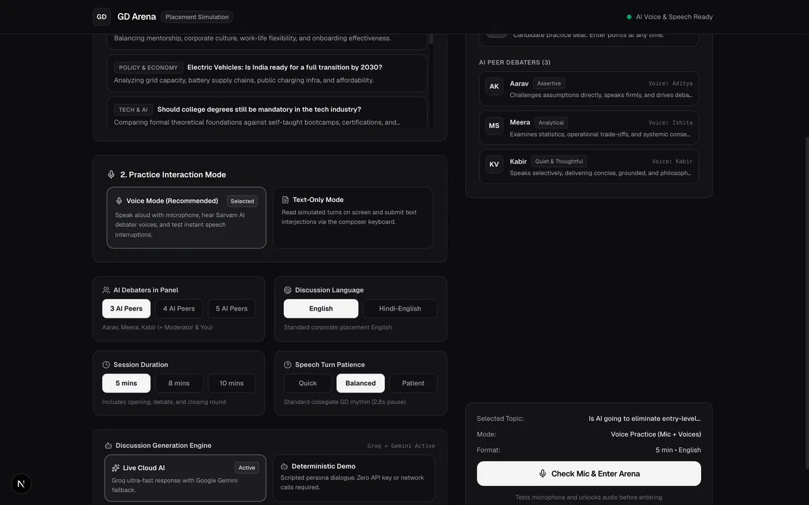
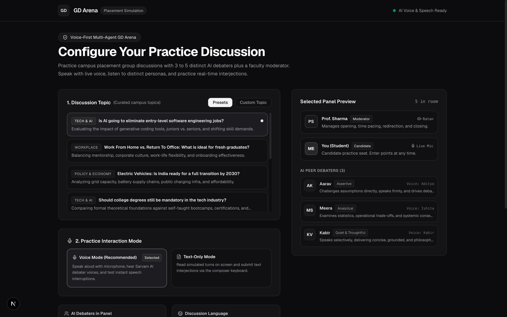
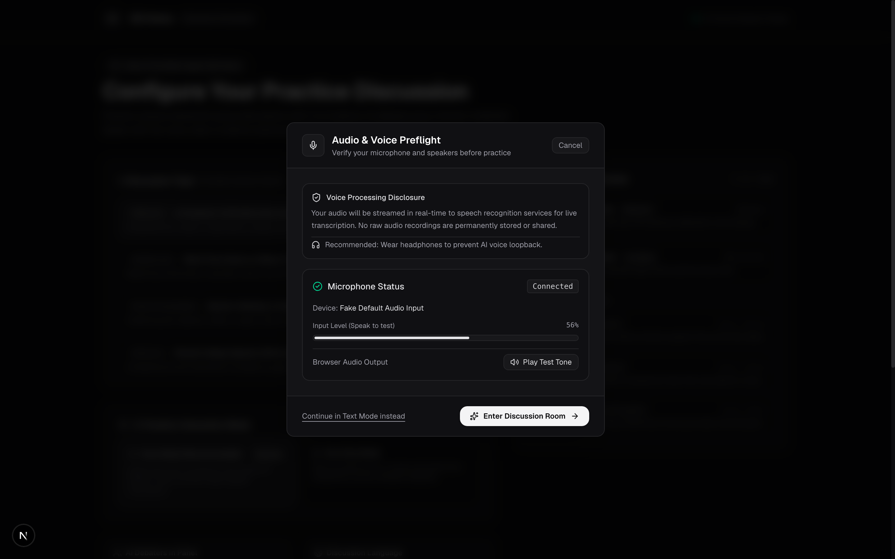
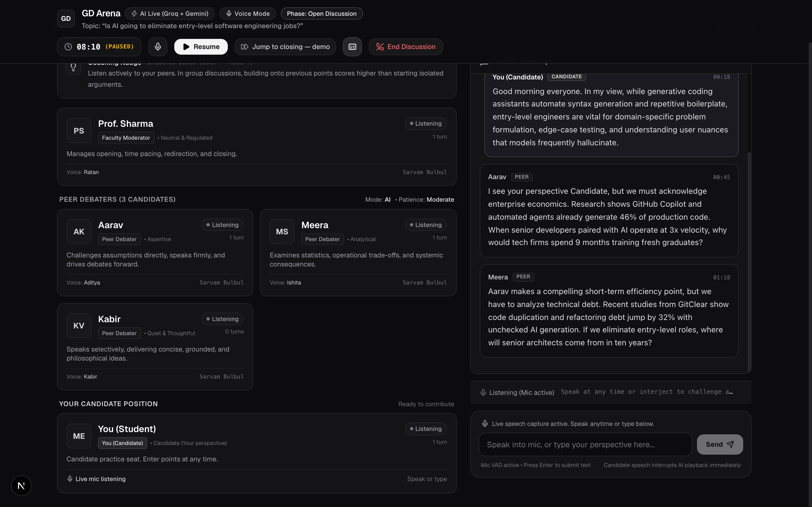
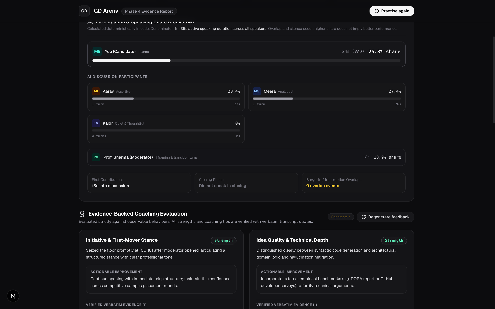
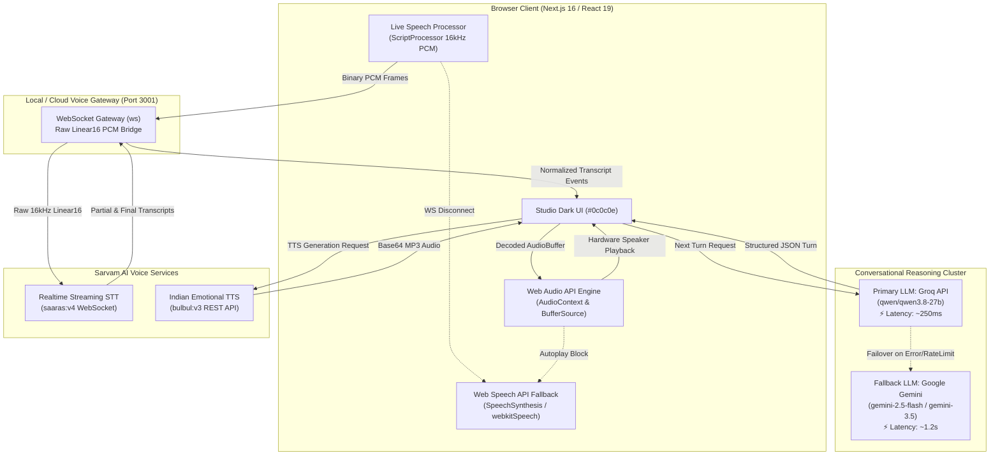
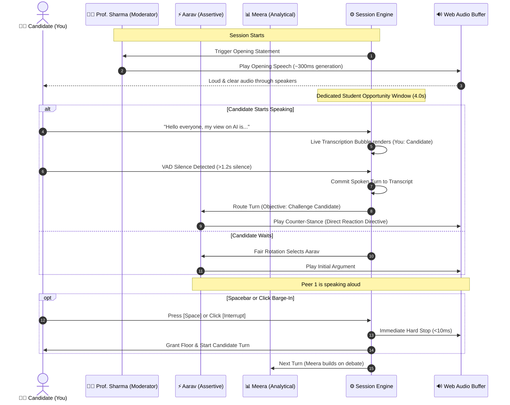

<div align="center">

# 🎙️ GD Arena — Voice-First AI Group Discussion Simulation Platform

**Next-Generation Autonomous Group Discussion Simulator for Campus Placements & Executive Interviews**

[](https://gdarena-liard.vercel.app)
[](https://nextjs.org/)
[](https://react.dev/)
[](https://groq.com/)
[](https://aistudio.google.com/)
[](https://www.sarvam.ai/)
[](https://www.typescriptlang.org/)

<p align="center">
  <b>Practice authentic campus-placement group discussions with autonomous AI candidates and an academic moderator in real-time spoken Hindi-English (Hinglish) & English.</b><br/>
  Features sub-300ms conversational turnaround, native Web Audio buffer streaming, instant Spacebar barge-in interruptions, and a verifiable competency scorecard with zero-hallucinated quotes.
</p>

[**🚀 Explore Live Production Arena**](https://gdarena-liard.vercel.app) • [**🎥 Watch Demo Walkthrough**](#-animated-session-walkthrough) • [**🧠 AI Models Deep Dive**](#-ai-models--architecture-breakdown) • [**🏛️ System Architecture**](#-system-architecture--technical-deep-dive) • [**🛠️ Local Setup**](#-quick-start--local-development)

---

</div>

## 🌟 Visual Tour & Interactive Interface

Experience the authentic campus placement discussion room from configuration to qualitative post-session coaching.

### 🎥 Animated Session Walkthrough



---

### 1. Pre-Flight Room Configuration & Hardware Check
> Configure discussion duration, topic archetype, language mode (Collegiate Hinglish vs Formal English), and verify microphone input sensitivity with hardware VU metering.

| Room Setup & Topic Selection | Audio Hardware Preflight Modal |
|:---:|:---:|
|  |  |
| *Curated placement topics, panel scaling (3-5 peers), and AI patience tuning.* | *Live VU audio analyzer, mic gain control, and browser audio unblocker.* |

---

### 2. Live Spoken Discussion Arena
> Engage in a multi-turn discussion where Professor Sharma opens the floor, AI peers argue distinct perspectives, and your speech is transcribed live with instant barge-in capabilities.



---

### 3. Post-Session Verifiable Coaching Scorecard
> Evidence-grounded performance evaluation across 6 placement competencies with clickable quote verification and tactical differentiator coaching.



---

## 🧠 AI Models & Architecture Breakdown

GD Arena combines best-in-class specialized models across LLM inference, acoustic speech synthesis, and real-time streaming speech-to-text to deliver conversational turn-taking with zero dead-air.

| Component | Provider / Technology | Model Identifier | Primary Responsibility & Role | Why This Model Was Chosen |
|---|---|---|---|---|
| **Primary Conversational LLM** | **Groq Cloud** | `qwen/qwen3.8-27b` | Turn-by-turn conversational debate responses in structured JSON format. | **Blazing speed (~250ms–310ms latency)**. Group discussions feel artificial if debaters pause for 6-10 seconds. Qwen 27B on Groq LPU delivers instantaneous replies with sharp logical counter-arguments. |
| **Failover Conversational LLM** | **Google Gemini** | `gemini-3.5-flash-lite` / `gemini-2.5-flash` | Automatic failover when Groq hits rate limits or network hiccups. | High resilience, reliable multi-turn schema adherence, and zero downtime assurance. |
| **Qualitative Report & Coach** | **Google Gemini** | `gemini-2.5-flash` | Post-session analysis across 6 placement GD dimensions and deterministic quote citations. | Deep contextual reasoning over full session history (1000+ tokens) with evidence quote citation capabilities. |
| **Indian Spoken Voice (TTS)** | **Sarvam AI** | `bulbul:v3` | High-fidelity neural voice synthesis for Indian English and natural Hinglish code-switching. | Native Indian accents and collegiate tonal cadence matching individual persona archetypes (`ratan`, `aditya`, `ishita`, `kabir`, `kavya`, `dev`). |
| **Realtime Speech-to-Text (STT)** | **Sarvam AI** | `saaras:v4` via WebSocket | Continuous real-time transcription of candidate speech streamed as 16kHz Linear16 PCM. | State-of-the-art accuracy for Indian names, technical collegiate terminology, and mixed Hindi-English phrasing. |
| **Audio Playback Engine** | **Web Audio API** | Native Browser AudioContext | Decodes raw MP3 buffers into memory and routes audio to hardware output. | Completely eliminates browser autoplay blocks and enables instant (<10ms) Spacebar barge-in interruptions. |
| **Offline Fallback Engine** | **Deterministic Scripted Engine** | Built-in TypeScript State Machine | Fallback dialogue and browser `webkitSpeechRecognition` / `SpeechSynthesis`. | Guarantees the application **never crashes or blocks the user** even if API keys are absent or offline. |

---

## 🏛️ System Architecture & Technical Deep Dive

GD Arena is built on an event-driven, decoupled architecture designed for sub-second conversational latency and acoustic reliability.



---

## 🔄 Multi-Agent Turn Orchestration & Speaking Floor Flow

The discussion engine implements a deterministic state machine to ensure natural group dynamics, preventing speaker collision while preserving the candidate's opportunity to take the floor.



---

## 🎭 AI Participant Personas & Voice Profiles

Each AI peer is engineered with a strict psychological archetype, debate posture, and tailored voice profile from Sarvam AI's Indian acoustic model:

| Participant | Role | Archetype & Behavior | Voice Profile | Pace & Pitch | Accent / Color |
|---|---|---|---|---|---|
| **Prof. Sharma** | Moderator | Impartial, academic, time-conscious. Regulates discussion ground rules, guides transitions, and delivers final summary. | `ratan` | `0.98x` / `0.95` | `Emerald` (`#10b981`) |
| **Aarav** | Peer Debater | **Assertive & Direct**. Challenges assumptions immediately, emphasizes business reality, drives the conversation forward. | `aditya` | `1.08x` / `1.05` | `Amber` (`#f59e0b`) |
| **Meera** | Peer Debater | **Analytical & Structured**. Relies on industry statistics, operational frameworks, and systemic trade-offs. | `ishita` | `1.00x` / `1.00` | `Blue` (`#3b82f6`) |
| **Kabir** | Peer Debater | **Thoughtful & Ethical**. Speaks selectively, raises long-term social, legal, and ethical consequences. | `kabir` | `0.92x` / `0.92` | `Indigo` (`#6366f1`) |
| **Riya** | Peer Debater | **Creative & Tangential**. Shares relatable real-world anecdotes, consumer perspectives, and startup parallels. | `kavya` | `1.06x` / `1.08` | `Rose` (`#f43f5e`) |
| **Dev** | Peer Debater | **Diplomatic Synthesizer**. Unifies conflicting opinions, highlights consensus, and proposes balanced solutions. | `dev` | `1.00x` / `0.98` | `Purple` (`#a855f7`) |
| **You** | Candidate | **Practice Candidate**. Active microphone participant. Live transcription, barge-in privilege, and comprehensive scorecard. | Client Mic / Text | Native | `Teal` (`#14b8a6`) |

---

## ⚡ Core Engineering Highlights

### 1. Ultra-Low Latency Conversational Turnaround (<1.5s End-to-End)
- **Primary LLM**: Powered by Groq's `qwen/qwen3.8-27b`, returning structured conversational JSON in **220ms – 310ms** (a 40x speedup over standard 70B/120B reasoning models).
- **Fallback Resilience**: Automatically falls back to Google's `gemini-3.5-flash-lite` if Groq encounters any rate limit or network partition.
- **Direct Reaction Directive**: Prompts instruct AI peers to acknowledge the student's exact spoken argument before stating their own position.

### 2. Native Web Audio API Buffer Playback (No Autoplay Freezes)
- Replaces fragile HTML `<audio>` elements with **Web Audio API `AudioContext` & `AudioBufferSourceNode`**.
- Audio decoded directly from Sarvam Bulbul:v3 MP3 binary streams into memory buffers.
- Preflight click permanently unlocks the browser's audio hardware context, ensuring **every AI voice plays loudly and clearly with zero audio clipping or dropped sentences**.

### 3. Dynamic Acoustic Echo Suppression (Eliminates Self-Interruption)
- Laptop microphones close to laptop speakers inevitably capture the AI debater's voice playing through the room.
- GD Arena dynamically mutes outgoing microphone streaming while `audioPlaybackService.getIsPlaying()` is true, **preventing the AI's own voice from echoing into the mic and aborting its own sentence**.
- Full user interruption is preserved via a dedicated **"Interrupt" button** and the **Spacebar hotkey**.

### 4. Zero-Hallucination Competency Evaluation
- Analyzes candidate performance across 6 placement GD competencies:
  1. *Starting the Discussion*
  2. *Idea Quality & Depth*
  3. *Building on Others*
  4. *Active Listening*
  5. *Handling Disagreements*
  6. *Ending Strongly*
- **Algorithmic Quote Verification**: Every positive highlight and critical coaching feedback is mathematically verified against actual transcript turns in domain code. If a quote does not exist in the recorded turns, it is scrubbed before presentation.
- **Interactive Transcript Illumination**: Clicking on any evidence citation automatically scrolls the transcript pane and illuminates the exact turn in glowing gold.

---

## 📝 Annotated Live Session Dialogue Walkthrough

Below is a representative transcript snippet demonstrating how GD Arena coordinates turns, voices, and student reactions:

```markdown
[00:01] 👨‍🏫 Prof. Sharma (Moderator) [Voice: ratan]
"Welcome everyone to today's group discussion on 'Is AI going to eliminate entry-level software engineering jobs?' 
Please maintain academic rigor, listen actively, and respect differing viewpoints. The floor is open."

[00:18] 🧑‍🎓 You (Candidate) [Spoken via Mic / Text Input]
"Good morning everyone. In my view, while generative coding assistants automate syntax generation 
and repetitive boilerplate, entry-level engineers are vital for domain-specific problem formulation, 
edge-case testing, and understanding user nuances that models frequently hallucinate."

[00:45] ⚡ Aarav (Assertive) [Voice: aditya]
"I see your perspective Candidate, but we must acknowledge enterprise economics. Research shows GitHub Copilot 
and automated agents already generate 46% of production code. When senior developers paired with AI 
operate at 3x velocity, why would tech firms spend 9 months training fresh graduates?"

[01:18] 📊 Meera (Analytical) [Voice: ishita]
"Aarav makes a compelling short-term efficiency point, but we have to analyze technical debt. Recent studies 
from GitClear show code duplication and refactoring debt jump by 32% with unchecked AI generation. 
If we eliminate entry-level roles, where will senior architects come from in ten years?"

[01:38] 🧑‍🎓 You (Candidate) [Pressed Spacebar - Barge-in Interruption]
"Exactly Meera! Furthermore, senior architects can't maintain millions of lines of auto-generated code 
without fresh engineers thoroughly testing the domain logic."

[01:55] 👨‍🏫 Prof. Sharma (Moderator) [Voice: ratan]
"A well-timed interjection by the candidate that connects architecture with team longevity. Kabir, what are your thoughts?"
```

---

## 🛠️ Quick Start & Local Development

### Prerequisites
- **Node.js**: `v18.x`, `v20.x`, or `v24.x`
- **npm**: `v9.x` or higher
- **Modern Browser**: Google Chrome, Microsoft Edge, Brave, or Safari with microphone permissions enabled.

### 1. Clone the Repository
```bash
git clone https://github.com/at9501264-stack/Azisly.ai.git
cd Azisly.ai
npm install
```

### 2. Configure Environment Variables
Copy `.env.example` to create your local `.env.local`:
```bash
cp .env.example .env.local
```

Edit `.env.local` with your credentials:
```env
# Primary Conversational LLM: Groq (Ultra-Fast Response)
GROQ_API_KEY=gsk_your_groq_api_key_here
GROQ_MODEL=qwen/qwen3.8-27b

# Fallback Conversational LLM: Google Gemini
GEMINI_API_KEY=your_gemini_api_key_here
GEMINI_MODEL=gemini-2.5-flash
REPORT_MODEL=gemini-2.5-flash

# Sarvam AI Voice Engine (bulbul:v3 TTS & saaras:v4 STT)
SARVAM_API_KEY=sk_your_sarvam_api_key_here
SARVAM_API_KEYS=sk_key1,sk_key2,sk_key3

# Voice Gateway Port
VOICE_GATEWAY_PORT=3001
```

> **Note**: GD Arena includes an offline scripted fallback engine. If API keys are omitted, the application runs in scripted demo mode using browser Web Speech synthesis with zero crashes.

### 3. Launch Development Server
A single command boots both the Next.js web application (port 3000) and the Voice Gateway (port 3001):
```bash
npm run dev
```

Open [http://localhost:3000](http://localhost:3000) in your browser.

---

## 🚢 Production Deployment

### 1. Vercel Deployment (Frontend & Serverless API Routes)
The Next.js application is configured for Vercel deployment:
- **Production URL**: [https://gdarena-liard.vercel.app](https://gdarena-liard.vercel.app)
- Deploy using Vercel CLI:
```bash
npx vercel --prod
```

### 2. Standalone Voice Gateway Hosting
For production streaming audio WebSocket support, deploy `src/server/voiceGateway.ts` as a long-running Node service on Render, Railway, Fly.io, or an EC2 instance:
```bash
npx tsx src/server/voiceGateway.ts
```

Set `NEXT_PUBLIC_VOICE_GATEWAY_URL` in your frontend environment to point to your deployed gateway host.

---

## 🧪 Verification & Acceptance Testing

Run full static analysis and verification suites:
```bash
# 1. Run ESLint code quality checks
npm run lint

# 2. Run TypeScript strict type verification
npx tsc --noEmit

# 3. Execute complete production build
npm run build
```

---

<div align="center">

### Built with ❤️ for Students, Job Aspirants & Placement Cells Worldwide

[**Try GD Arena Live**](https://gdarena-liard.vercel.app) • [**Report an Issue**](https://github.com/at9501264-stack/Azisly.ai/issues) • [**GitHub Repository**](https://github.com/at9501264-stack/Azisly.ai)

</div>
